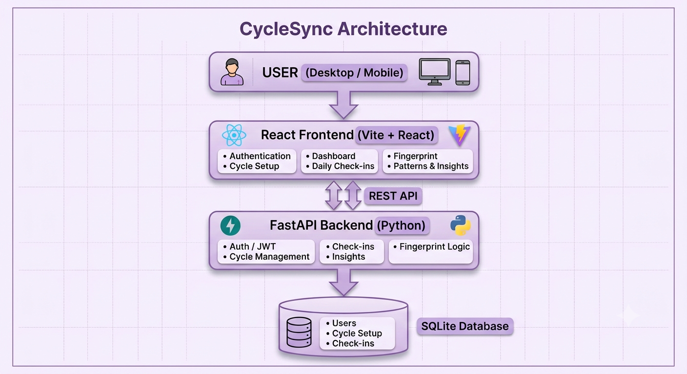

CycleSync 

■ Personalized Cycle-Aware Wellness & Productivity Planner
CycleSync is a full-stack web application designed to help users understand their menstrual cycle phases and plan
their wellness and productivity around their personal cycle patterns. The application combines cycle tracking, daily
wellness check-ins, personalized pattern insights, and secure user authentication in one simple, responsive platform.

■ Live Demo
Frontend: https://cyclesync-muli.onrender.com
Backend API: https://cyclesync-api-a0fq.onrender.com

■ Features

■ User Authentication
• User signup and login
• Secure password hashing using PBKDF2-SHA256
• JWT-based authentication
• Protected application routes
• User-specific cycle and wellness data
• Logout and session management

■ Cycle Setup
Users can enter:
• Last period date
• Average cycle length
CycleSync then calculates the current cycle day and phase based on the configured cycle information.

■ Personalized Dashboard
• Current cycle day
• Current cycle phase
• Cycle progress
• Personalized wellness guidance
• Quick access to daily check-ins
• Pattern and fingerprint insights

■ Daily Check-In
• Energy
• Mood
• Pain
• Sleep
• Symptoms
• Personal notes
Each check-in is associated with the user's current cycle information.

■ Personal Cycle Fingerprint
• Average energy
• Average mood
• Average pain
• Commonly reported symptoms
• Data strength

■ Patterns & Insights
The application provides simple rule-based observations from the user's recorded data to help identify recurring
wellness patterns over time.

■ Responsive Design
• Mobile phones
• Tablets
• Laptops
• Desktop screens
The interface uses a clean, wellness-focused design with responsive cards, navigation, forms, and dashboards.

■ How CycleSync Works
Cycle Setup
 ↓
Personalized Dashboard
 ↓
Daily Check-In
 ↓
Personal Cycle Fingerprint
 ↓
Patterns & Insights
Users first configure their cycle and then gradually build their personal wellness history through daily check-ins. As
more data is recorded, CycleSync can provide more meaningful personal pattern observations.

■■ Tech Stack
Frontend
• React
• Vite
• JavaScript
• Axios
• React Router
• Lucide React
• CSS
Backend
• Python
• FastAPI
• Pydantic
• Uvicorn
Database
• SQLite
Authentication & Security
• JWT authentication
• PBKDF2-SHA256 password hashing
• Environment-based secret configuration
• Protected API routes
• User-specific database access
Deployment & Version Control
• Render
• Git
• GitHub

■ Architecture

CycleSync follows a simple client-server architecture where the React frontend communicates with a FastAPI backend through REST APIs. The backend handles authentication, cycle calculations, check-ins, and rule-based wellness insights, while SQLite stores user and cycle data.

■  Application Flow

1. **User** interacts with CycleSync through the responsive React interface.
2. **React Frontend** handles authentication, cycle setup, dashboard views, daily check-ins, fingerprint, and patterns.
3. **FastAPI Backend** processes requests through REST APIs and manages authentication, cycle logic, check-ins, and insights.
4. **SQLite Database** stores user accounts, cycle setup information, and daily check-in records.
5. **JWT Authentication** keeps user data separated between accounts and protects authenticated API routes.

■ Project Structure
CycleSync/
■
■■■ backend/
■ ■■■ venv/
■ ■■■ main.py
■ ■■■ database.py
■ ■■■ models.py
■ ■■■ auth.py
■ ■■■ requirements.txt
■ ■
■ ■■■ routes/
■ ■■■ auth.py
■ ■■■ cycle.py
■ ■■■ checkins.py
■ ■■■ fingerprint.py
■
■■■ frontend/
■ ■■■ src/
■ ■ ■■■ pages/
■ ■ ■ ■■■ Dashboard.jsx
■ ■ ■ ■■■ MyCycle.jsx
■ ■ ■ ■■■ CycleSetup.jsx
■ ■ ■ ■■■ CheckIn.jsx
■ ■ ■ ■■■ Fingerprint.jsx
■ ■ ■ ■■■ Patterns.jsx
■ ■ ■ ■■■ Signup.jsx
■ ■ ■ ■■■ Login.jsx
■ ■ ■
■ ■ ■■■ api.js
■ ■ ■■■ App.jsx
■ ■ ■■■ App.css
■ ■ ■■■ index.css
■ ■ ■■■ ProtectedRoute.jsx
■ ■
■ ■■■ package.json
■
■■■ .gitignore
■■■ README.md

■ API Overview
CycleSync uses a FastAPI backend to manage authentication, cycle information, check-ins, and personalized
insights.

Authentication
POST /api/auth/signup
POST /api/auth/login

Cycle
POST /api/cycle/setup
GET /api/cycle/current

Daily Check-Ins
POST /api/checkins/
GET /api/checkins/

Personal Fingerprint
GET /api/fingerprint/

Health Check
GET /health

■ Run CycleSync Locally
Follow the steps below to run CycleSync on your own computer.
■ Prerequisites
• Python 3.12+
• Node.js 18+
• npm
• Git
• A code editor such as VS Code
Verify the installations:
python --version
node --version
npm --version
git --version

1■■ Clone the Repository
git clone https://github.com/Laharyy/CycleSync.git
cd CycleSync
The project contains two main parts: backend (FastAPI + Python) and frontend (React + Vite).
2■■ Open the Backend Folder
cd backend
3■■ Create a Python Virtual Environment
python -m venv venv
This creates a separate Python environment for the CycleSync backend and prevents its packages from interfering
with other projects.
4■■ Activate the Virtual Environment
.\venv\Scripts\Activate.ps1
After activation, you should see (venv) at the beginning of your terminal prompt.
If PowerShell blocks activation, run:
Set-ExecutionPolicy -ExecutionPolicy RemoteSigned -Scope CurrentUser
Then activate the environment again.
5■■ Install Backend Dependencies
pip install -r requirements.txt
6■■ Create the Backend Environment File
Inside the backend folder, create .env and add:
CYCLESYNC_SECRET_KEY=your-secret-key
FRONTEND_URL=http://localhost:5173
Use a strong random secret for local development. Never upload the .env file to GitHub.
7■■ Start the Backend Server
python -m uvicorn main:app --reload
The backend should be available at http://127.0.0.1:8000. Keep this terminal running.
8■■ Check the Backend
Open http://127.0.0.1:8000 in a browser. You should see:
{"message": "CycleSync API is running"}
Interactive API documentation is available at http://127.0.0.1:8000/docs.
9■■ Open a Second Terminal
Do not stop the backend terminal. Open a new PowerShell terminal or VS Code terminal tab.
cd CycleSync
cd frontend

■ Install Frontend Dependencies
npm install
1■■1■■ Create the Frontend Environment File
Inside the frontend folder, create .env and add:
VITE_API_URL=http://127.0.0.1:8000
1■■2■■ Start the Frontend
npm run dev
Vite will show the local frontend URL, normally http://localhost:5173.

■ Running CycleSync Locally
Terminal 1 — Backend
cd CycleSync\backend
.\venv\Scripts\Activate.ps1
python -m uvicorn main:app --reload
Terminal 2 — Frontend
cd CycleSync\frontend
npm run dev
Both servers need to remain running while using CycleSync locally.

■ Local Application URLs
Purpose URL
CycleSync Frontend http://localhost:5173
Backend API http://127.0.0.1:8000
FastAPI Documentation http://127.0.0.1:8000/docs
Backend Health Check http://127.0.0.1:8000/health

■ Stopping the Local Servers
In each running terminal, press:
Ctrl + C

■ Starting CycleSync Again Later
You do not need to recreate the virtual environment or reinstall everything every time.
Backend:
cd CycleSync\backend
.\venv\Scripts\Activate.ps1
python -m uvicorn main:app --reload
Frontend:
cd CycleSync\frontend
npm run dev
Then open http://localhost:5173.

■ Common Issues
Python is not recognized
python --version
Make sure Python is installed and added to your system PATH.
npm is not recognized
node --version
npm --version
Install Node.js and verify the versions.
PowerShell does not allow virtual environment activation
Set-ExecutionPolicy -ExecutionPolicy RemoteSigned -Scope CurrentUser
.\venv\Scripts\Activate.ps1
Frontend cannot connect to the backend
• Make sure the backend server is running.
• Confirm the backend is available at http://127.0.0.1:8000.
• Confirm the frontend .env contains VITE_API_URL=http://127.0.0.1:8000.
• Restart the frontend after changing .env.
Port 8000 is already in use
python -m uvicorn main:app --reload --port 8001
If the backend port changes, update the frontend VITE_API_URL accordingly.
Port 5173 is already in use
Vite may automatically use another available port, such as http://localhost:5174. Open the URL shown in the terminal.

■■ Database
CycleSync currently uses SQLite for lightweight data storage.
• User accounts
• Cycle setup information
• Daily check-ins
User-specific records are protected through authenticated user IDs.
For a larger production deployment, SQLite can be migrated to PostgreSQL with persistent cloud database
infrastructure.

■ Cycle Phase Model
CycleSync currently uses a simplified planning model:
Cycle Day Phase
1–5 Menstrual
6–13 Follicular
14 Ovulatory
15+ Luteal
This model is used for wellness and productivity planning, not for medical diagnosis or clinical prediction.
Individual menstrual cycles can vary considerably.

■ Personal Insights
CycleSync currently uses rule-based analysis to generate wellness observations from recorded check-ins.
• Energy patterns
• Mood patterns
• Pain levels
• Frequently reported symptoms
• Overall amount of available check-in data
These insights are intended to support personal awareness and reflection. They are not medical diagnoses or
medical advice.

■ Privacy & Security
• Password hashing using PBKDF2-SHA256
• JWT-based authentication
• Protected API endpoints
• User-specific database queries
• Environment variables for secrets
• .env files excluded from Git
• CORS configuration for the deployed frontend
Sensitive authentication secrets are not stored in the public repository.

■ Deployment
CycleSync is deployed using Render.
Frontend: https://cyclesync-muli.onrender.com
Backend: https://cyclesync-api-a0fq.onrender.com
The frontend communicates with the deployed FastAPI backend through environment-based API configuration.

■■ Current Limitations
Database Persistence
The current deployment uses SQLite. A future version can use PostgreSQL with persistent cloud storage.
Cycle Model
The current cycle-phase calculation is simplified and should not be considered a clinical prediction system.
Insights
Current insights are rule-based rather than machine-learning based. Future versions could explore more advanced
personalized analytics after collecting sufficient anonymized data and establishing appropriate validation.

■ Future Improvements
• PostgreSQL database integration
• Advanced personalized analytics
• More flexible cycle-phase modeling
• Better long-term trend analysis
• Calendar-based cycle visualization
• Reminder and notification system
• Exportable personal wellness reports
• Improved accessibility
• Automated testing and CI/CD
• More advanced privacy and data-management controls

■ Project Highlights
• Frontend development
• Backend API development
• Authentication
• Database design
• REST API integration
• Responsive UI design
• Data-driven personalization
• Cloud deployment
• Git and GitHub workflow
The project also focuses on keeping health-related insights understandable and clearly separating wellness
observations from medical claims.

■ Testing
The application was tested across the major user flows:
• User signup
• User login
• Cycle setup
• Dashboard
• Daily check-in
• Personal Cycle Fingerprint
• Patterns & Insights
• Logout
• Login again
• Mobile responsive layout
• Desktop responsive layout
• Local development environment
• Production deployment

■ Project Status
Current Status: Portfolio-Ready v1.0.0
The current release includes the complete core user flow, authentication, personalized cycle tracking, wellness
check-ins, insights, responsive UI, and cloud deployment.

■■■ Author
Lahari Y
B.Tech Computer Science & Engineering — AI/ML

■ License
This project is created for educational, portfolio, and demonstration purposes.